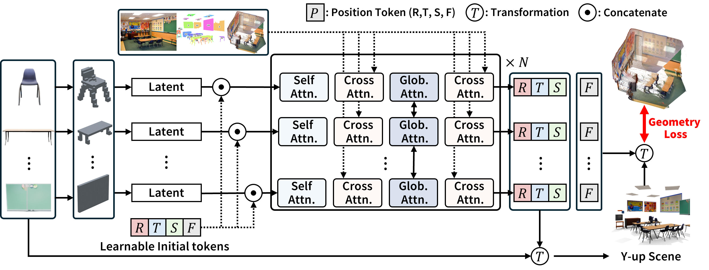

# 📐 GALP — Geometry-Aware Layout Prediction

> Geometry-Aware Layout Prediction (GALP) is a core submodule of
> SceneConductor that predicts an initial 3D scene layout from segmented
> object masks and corresponding GLB assets.

🔗 **Project:** https://github.com/jhkim0759/SceneConductor

---

## ✨ Overview

GALP takes the segmented objects produced in **Stage 1** and predicts:
<p align="center">
    
</p>

Within the SceneConductor pipeline, GALP serves as the **final step of Stage 1**.

The generated outputs:

```text
layout_prediction.json
layout_prediction.glb
```

---

## 📂 Model Checkpoints

The `checkpoints/` directory in this repository is provided as a placeholder.

All pretrained GALP checkpoints can be downloaded from:

🤗 **Hugging Face**

https://huggingface.co/WopperSet/SceneConductor

```bash
from huggingface_hub import snapshot_download

local_dir = snapshot_download(
    repo_id="WopperSet/SceneConductor",
    allow_patterns="checkpoints/*",
    local_dir="./checkpoints"
)
```

Expected structure:

```text
checkpoints/galp/
├── checkpoint.pt
├── pipeline.yaml
├── galp.yaml
└── condition_embedder.ckpt
```

For detailed checkpoint organization and download instructions, please refer to the main SceneConductor repository.

---

## 🛠️ Environment Setup

Environment creation is managed through YAML configuration files.

```bash
./setup.sh
```

Or update the provided YAML according to your system configuration.

---

## 🚀 Quick Start

Run GALP on a sample scene:

```bash
python demo.py --scene assets/0000000 \
                --ckpt  checkpoints/checkpoint.pt \
                --output output/demo_scene.glb \
                --gpu 0
```

### 📥 Input

```text
assets/0000000/
├── object_masks/
├── object_glbs/
└── metadata.json
```

### 📤 Output

```text
output/
├── demo_scene.glb
└── layout_prediction.json
```

---

## 🗄️ Dataset

🚧 **Coming Soon**

Dataset preparation and download instructions will be released in a future update.

Planned support includes:

* 🪑 3D-FUTURE
* 🏢 ScanNet
* 🖼️ COCO

Stay tuned!

---

## 🎓 Training

Modify the training scripts according to your environment:

* GPU configuration
* Number of workers
* Dataset paths
* Batch size
* Training hyperparameters

### Initial Layout Training

```bash
sh script/train_init.sh
```

### Post Refinement Training

```bash
sh script/train_post.sh
```

---

## 📁 Repository Structure

```text
GALP/
├── assets/
├── checkpoints/
├── configs/
├── script/
├── demo.py
└── README.md
```

---

## 🙏 Acknowledgements

This project builds upon several outstanding open-source works:

- [SceneGen](https://github.com/mengmouxu/scenegen)
- [PartCrafter](https://github.com/wgsxm/PartCrafter)
- [SAM3D](https://github.com/facebookresearch/sam-3d-objects)

We thank the authors for open-sourcing their work.

## 📜 Citation

If you find GALP useful for your research, please consider citing the corresponding SceneConductor paper.

⭐ Star the repository if it helps your work!
